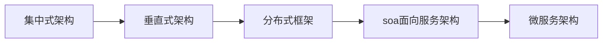

## 1.系统框架演变概述

目标：了解项目框架的演变过程

 集中式架构  垂直式架构 

 分布式架构  SOA


小结：



## 2.微服务架构说明

目标：了解SOA与微服务架构的区别，并说出微服务架构的特点

分析：SOA使用ESB组件面向服务架构：ESB自身实现复杂，服务粒度较大；所有的服务都会通过ESB，会降低通信的速度；测试、部署ESB比较麻烦。


用户发送请求，到API网关，网关调用具体的RESTful服务，服务治理管理RESTful服务。

API Gateway网关是一个服务器，是系统的唯一入口：

​	处理业务！身份验证、监控、负载均衡、缓存、请求分片与管理、静态响应。

服务治理也叫服务注册中心：zookeeper是注册中心 zuul是网关

​	服务把地址注册到服务中心，用的时候由服务中心调度。

微服务的特点：

1. ​	微服务中，每一个服务都对应唯一的业务能力，做到**单一职责**
2. ​	微：微服务拆分力度很小，比如“用户管理”可以作为一个服务。每个服务虽小，但是“五脏俱全”
3. ​	面向服务：每个服务都要对外暴露RESTful接口API，并不关心内部实现的技术，不管是C、C++、GO、Python都可以
4. ​	自治：服务之间相互独立，互不干扰。

- ​			团队独立：每个服务都是独立的团队，人数不能过多
- ​			技术独立：因为是面向服务，提供Rest几口，后端不再为PC、移动端开发不同接口。
- ​			数据库分离：每个服务都是用自己的数据源
- ​			部署独立：服务间虽然有调用，但是做到服务重启不影响其他服务。有利于持续继承和持续交付。每个服务都是独立的组件，可复用，可替换，降低耦合，易维护。

小结：

微服务架构:是一套使用小服务或者单一业务来开发单个应用的方式或途径。

微服务架构特点：

单一职责

服务粒度小

面向服务（对外暴露REST API）

服务之间相互独立

与使用ESB的SOA机构的区别：微服务架构没有使用ESB，有服务治理注册中心；业务粒度小。

## 3.微服务调用方式说明

无论是微服务还是SOA，都面临着服务间的远程调用。那么服务间的远程调用方式有哪些呢？

常见的远程调用方式有立下2种：

PRC：Remote Produce Call 远程过程调用，PRC基于Socket，工作在会话层。自定义数据格式，速度快，效率高。早期的webservice，现在热门的dubbo，都是PRC的典型代表。

HTTP：HTTP其实是一种网络传输协议，基于TCP，工作在应用层，规定了数据传输的格式。现在客户端浏览器与服务端通信基本都是采用HTTP协议，也可以用来进行远程服务调用。缺点是消息封装臃肿，优势是对服务的提供和调用方没有任何技术规定，自由灵活，更符合微服务理念。

现在热门的Rest风格，就可以通过HTTP协议来实现。

区别：PRC的机制是根据语言的API（LANGUAGE API）来定义的,而不是根据基于网络的应用来定义的。

目标：能够输出服务调用方式

小结：

RPC：基于socket，速度快，效率高；webservice dubbo

HTTP：居于TCP，封装比较臃肿；对服务和调用方没有任何技术，语言的限定，自由灵活；RESTful，Spring Cloud

## 4.Spring RestTemplate示例工程导入

目标：了解Spring RestTemplate的应用

分析：

一般情况下有如下三种HTTP客户端工具类包，都可以方便的进行HTTP服务调用：

httpClient

okHttp

JDK原生URLConnection

Spring提供了RestTemplate的工具类对上述的三种HTTP客户端工具类进行了封装可以在Spring项目中使用RestTemplate进行服务调用

小结：


## 5.Spring Cloud概述

目标：SpringCloud整合的组件和版本特征

SpringCloud最擅长的就是集成，把世界上最好的框架拿过来，集成到自己的项目中。

实现了诸如：配置管理，服务发现，智能路由，负载均衡，熔断器，控制总线，集群状态等功能；协调分布式环境中各个系统，为各类服务提供模板性配置。其主要涉及的组件包括：

Eureka：注册中心

Zuul（不再维护）、Gateway：服务网关

Ribbon：负载均衡

Feign：服务之间相互调用

Hystrix或Resilience4j：熔断器

ConfigServer：Git配置


小结：

整合的组件可以在有需要的时候项目添加对于启动器的依赖即可。

版本特征：以英国地铁站名字命名

## 6.创建微服务工程

目标：创建微服务父工程itcast-springcloud、用户服务工程user-service、服务消费工程consumer-demo

分析：

需求：查询用户数据库中的数据，并输出到浏览器

- 父工程itcast-springcloud：添加spring boot父座标和管理其他组件的依赖
- 用户服务工程user-service：整合mybatis查询数据库中用户数据；提供查询用户服务
- 服务消费工程consumer-demo：利用出阿薰用户服务获取用户数据并输出到浏览器

小结：

```xml
            <!-- spring cloud -->
            <dependency>
                <groupId>org.springframework.cloud</groupId>
                <artifactId>spring-cloud-dependencies</artifactId>
                <version>${spring-cloud.version}</version>
                <type>pom</type>
                <scope>import</scope>
            </dependency>
```

上面意思是：通过<scope>import</scope>

父工程不仅要继承Spring Boot坐标，还要继承spring-cloud-dependencies的坐标。

## 7.搭建user-service工程

目标：配置user-service工程并能够根据用户id查询数据库中用户

分析：可以访问http://localhost:9091/user/8输出用户数据

实现步骤：

添加启动器依赖（web、通用Mapper）

创建启动引导类配置文件

修改配置文件中的参数

编写测试代码（UserMapper、UserService、UserController）

测试

小结：

添加启动器依赖

```xml
        <!-- Test启动器 -->
        <dependency>
            <groupId>org.springframework.boot</groupId>
            <artifactId>spring-boot-starter-test</artifactId>
        </dependency>

        <!-- 通用Mapper -->
        <dependency>
            <groupId>tk.mybatis</groupId>
            <artifactId>mapper-spring-boot-starter</artifactId>
        </dependency>

        <!-- MySQL驱动 -->
        <dependency>
            <groupId>mysql</groupId>
            <artifactId>mysql-connector-java</artifactId>
        </dependency>
        <dependency>
            <groupId>junit</groupId>
            <artifactId>junit</artifactId>
            <scope>test</scope>
        </dependency>
```

编写配置文件

```yml
#tomcat配置
server:
  port: 9091
#spring配置
spring:
  datasource:
    driver-class-name: com.mysql.jdbc.Driver
    url: jdbc:mysql://127.0.0.1:3306/spring_cloud?useSSL=false
    username: root
    password: langri
  jackson:
    serialization:
      WRITE_DATES_AS_TIMESTAMPS: true
```

## 8.搭建配置consumer-demo工程

目标：编写测试类使restTemplate访问user-service的路径根据id查询用户

分析：

需求：访问http://localhost:8080/consumer/1 使用RestTemplate获取http://localhost:9091/user/1用户信息

实现：

1. 添加启动器依赖
2. 创建启动引导类（注册RestTemplate）和配置文件
3. 编写测试代码（ConsumerController中使用restTemplate访问服务获取数据）
4. 测试

小结：

消费工程调用服务工程问题：

- 服务管理

  - 如何自动注册和发现

  - 如何实现状态监管

  - 如何实现动态路由

- 服务如何实现负载均衡

- 服务如何解决容灾问题

- 服务如何实现统一配置

  上述的各种问题都可以通过Spring Cloud的各种组件解决。

## 9.Eureka注册中心

目标：说出Eureka的主要功能

架构图


小结：

Eureka的主要功能是进行服务管理，定期检查服务状态，返回服务地址列表。


## 10.搭建eureka-server工程

目标：添加eureka对应依赖和编写引导类搭建eureka服务并访问eureka服务界面

分析：Eureka是服务注册中心，只做服务注册；自身并不提供服务。可以搭建web工程使用eureka，可以使用spring boot方式搭建。

搭建步骤：

创建工程

添加启动器依赖

编写启动引导类（添加Eureka的服务注解）和配置文件

修改配置文件（端口、应用名称、。。。）

测试，进入服务界面

小结：

启动器依赖

```xml
    <dependencies>

        <dependency>
            <groupId>org.springframework.cloud</groupId>
            <artifactId>spring-cloud-starter-netflix-eureka-server</artifactId>
        </dependency>

    </dependencies>
```

配置文件

```yml
# 修改服务器端口
server:
  port: 10086

# 设置服务名称
spring:
  application:
    name: EurekaServer

# 配置Eureka
eureka:
  client:
    # Eureka客户端服务地址
    service-url:
      defaultZone: http://127.0.0.1:10086/eureka
    # 要不要把自己注册到Eureka
    register-with-eureka: false
    # 不拉取服务
    fetch-registry: false
```

## 11.服务注册与发现

目标：将user-server的服务注册到eureka并在consumer-demo中可以根据服务名称调用

分析：

- 服务注册：在服务提供工程user-service添加Eureka客户端依赖；可以自动将服务注册到EurekaServer地址列表。
  - 添加Eureka客户端依赖；
  - 改造启动引导类；添加开启Eureka客户端发现的注解；
  - 修改配置文件；设置Eureka服务地址，服务名称
- 服务发现：在服务消费工程consumer-demo上添加Eureka客户端依赖；可以使用工具类根据服务名获取对应的服务地址列表。
  - 添加Eureka客户端依赖；
  - 改造启动引导类；添加开启Eureka客户端发现的注解；
  - 修改配置文件；设置Eureka服务地址
  - 改造处理器类ConsumerController，可以使用工具类DiscoveryClient根据服务名称获取对应的地址列表。

小结：

都要添加Eureka客户端依赖

```xml
<dependency>
    <groupId>org.springframework.cloud</groupId>
    <artifactId>spring-cloud-starter-netflix-eureka-client</artifactId>
</dependency>
```

添加启动引导类注解

```java
@SpringBootApplication
//开启Eureka服务客户端
@EnableDiscoveryClient
public class ConsumerApplication {
    public static void main(String[] args) {
        SpringApplication.run(ConsumerApplication.class, args);
    }

    @Bean
    public RestTemplate restTemplate(){
        return new RestTemplate();
    }
}
```

修改配置

```yaml
# Spring配置
spring:
  application:
  	# 自己的服务名
    name: consumer-demo

# Eureka配置
eureka:
  client:
    service-url:
      # Eureka客户端服务地址
      defaultZone: http://127.0.0.1:10086/eureka
```

## 12.Eureka Server高可用配置

目标：可以启动两台eureka-server实例；在eureka管理界面看到两个实例

分析：

Eureka Server是一个web应用，可以启动多个实例（配置不同端口）保证Eureka Server的高可用

Eureka架构的三个核心角色：

- 服务注册中心

  Eureka 的服务端应用，提供服务注册和发现功。

  本例就是刚刚建立的Eureka Server

- 服务提供者

  提供服务的应用，可以是Spring Boot应用，亦可以是其他任何语言的应用，只要对外提供restful风格的接口即可。

  本例就是user-service

- 服务消费者

  消费应用从注册中心获取服务列表，从而得知每个服务方的信息。

  本例是consumer-demo

小结：

高可用配置：

将Eureka Server作为服务注册到其他Eureka Server，这样多个Eureka Server之间就能互相发现对方，同步服务，实现Eureka Server集群。

要把注册和服务拉取设为true

```yaml
# 要把自己注册到Eureka
register-with-eureka: true
# 拉取服务
fetch-registry: true
```

## 13.Eureka客户端与服务端配置

目标：配置eureka客户端user-service的注册、续约等配置，配置eureka客户端consumer-demo的获取服务间隔时间；了解失效剔除和自我保护

分析：

- Eureka客户端工程
  - user-service服务提供工程
    - 服务地址使用IP方式
    - 续约
  - consumer-demo服务消费
    - 获取服务地址的频率
- Eureka服务端工程
  - 失效剔除
  - 自我保护

小结：

user-service

```yaml
# Eureka配置
eureka:
  client:
    service-url:
      # Eureka客户端服务地址
      defaultZone: http://127.0.0.1:10086/eureka
  instance:
    # 更倾向使用IP地址，而不是host名
    prefer-ip-address: true
    # IP地址
    ip-address: 127.0.0.1
    # 30S后等待90S未向注册中心发送消息 则剔除该服务 （生产环境默认即可）
    lease-expiration-duration-in-seconds: 5
    # 每隔30S向注册中心发送消息 （生产环境默认即可）
    lease-renewal-interval-in-seconds: 5
```

consumer-demo

```yaml
# Eureka配置
eureka:
  client:
    service-url:
      # Eureka客户端服务地址
      defaultZone: http://127.0.0.1:10086/eureka
    # 每隔30S 拉取一次服务
    registry-fetch-interval-seconds: 10
```

eureka-server

```yaml
# 配置Eureka
eureka:
  client:
    service-url:
      # Eureka客户端服务地址
      defaultZone: http://127.0.0.1:10086/eureka
    # 要不要把自己注册到Eureka
    register-with-eureka: false
    # 不拉取服务
    fetch-registry: false
  server:
    # 关闭自我保护机制 默认true
    enable-self-preservation: false
    # 服务剔除机制失效时间间隔 默认60S
    eviction-interval-timer-in-ms: 60000
```

## 14.负载均衡Ribbon简介

目标：描述负载均衡和ribbon的作用

分析：

负载均衡是一个算法，可以通过该算法实现从地址列表获取一个地址进行服务调用。

在spring cloud中提供了ribbon负载均衡器。默认提供了很多算法：轮询、随机。。。

轮询 123123123

随机3231123131223313333111132222

小结：

Ribbon提供了轮询、随机两种负载均衡算法（默认是轮询）可以实现从地址列表中使用负载均衡算法获取地址进行服务调用。

## 15.Ribbon负载均衡应用

目标：配置启动两个用户服务，在consumer-demo中使用服务名实现根据用户id获取用户信息

分析：

需求：可以使用RestTemplate访问http://user-service/user/1获取服务数据

可以使用Ribbon负载均衡：在执行RestTemolate发送服务地址请求的时候，使用负载均衡算法从服务地址列表中选择一个服务地址，访问该地址获取服务数据。

实现步骤：

1. 启动多个user-service实例（9091，9092）；
2. 修改RestTemplate实例化方法，添加负载均衡注解；
3. 修改ConsumerController；
4. 测试

小结：

在实例化RestTemplate的时候使用@LoadBalanced，服务地址可以直接使用服务名。

默认轮询；可以修改成随机


## 16.熔断器Hystrix（豪猪）简介

目标：了解熔断器Hystrix的作用

介绍：

如果服务器中某些请求未能执行完毕，就会一直等待，从而阻塞线程，等待的线程多了，服务器支持的线程和并发数有限，容易引起服务器过载（也就是雪崩效应）。

Hystrix解决雪崩问题的手段主要就是服务降级，包括：

- 线程隔离
- 服务熔断

小结：

Hystrix是一个延迟和容错库，用户隔离访问远程服务，防止出现级联失败。

## 17.线程隔离和服务降级

目标：了解什么是线程隔离和服务降级

分析：

Hystrix解决雪崩效应：

线程隔离：用户请求不直接访问服务，而是使用线程池中空闲的线程访问服务，加速失败判断时间。

服务降级：及时返回服务调用失败的结果，让线程不因等待服务而阻塞。

解读：

Hystrix为每个以来服务分配一个小的线程池，如果线程池已满调用将被立即拒绝，默认不排队**加速失败判定时间**。

用户的请求将不再直接访问服务，而是通过线程池中的空闲线程来访问服务，如果**线程池已满**，或者**请求超时**，则会进行降级处理，什么是服务降级？

> 服务降级：优先保证核心服务，而非核心服务不可用或弱可用。

（等待一段时间没有返回结果，就返回失败结果）

触发Hystrix服务降级的情况：

- 线程已满
- 请求超时

操作步骤：

1. 引入依赖 ：spring-cloud-starter-netflix-hystrix
2. 开启熔断：启动器上添加@EnableCircuitBreaker
3. 编写降级逻辑 业务中添加@HystrixCommand
4. 默认的Fallback 服务不可用的时候返回的信息
5. 超时设置

小结：

- 添加依赖

  ```xml
  <dependency>
      <groupId>org.springframework.cloud</groupId>
      <artifactId>spring-cloud-starter-netflix-hystrix</artifactId>
  </dependency>
  ```

- 开启熔断

  ```java
  /*
  @SpringBootApplication
  @EnableDiscoveryClient //开启eureka客户端发现功能
  @EnableCircuitBreaker //开启熔断 CircuitBreaker=断路器
  */
  // @SpringCloudApplication = 上边三个
  @SpringCloudApplication
  public class ConsumerApplication {
      public static void main(String[] args) {
          SpringApplication.run(ConsumerApplication.class, args);
      }
  
      @Bean
      @LoadBalanced
      public RestTemplate restTemplate(){
          return new RestTemplate();
      }
  }
  ```

- 降级逻辑

  ```java
  @RestController
  @RequestMapping("/consumer")
  @Slf4j
  //熔断方法配置
  @DefaultProperties(defaultFallback = "defaultFallback")
  public class UserController {
      @Autowired
      private RestTemplate restTemplate;
  
      @GetMapping("/{id}")
      //开启熔断
      //@HystrixCommand(fallbackMethod = "getUserFallback")
      @HystrixCommand
      public String getUserById(@PathVariable long id){
          String url ="http://user-service/user/"+id;
          return restTemplate.getForObject(url, String.class);
      }
  
      //单独restfulApi上的熔断方法
      public String getUserFallback(long id){
          log.error("请求用户信息失败 id={}",id);
          return "您的请求阻塞，请重新操作或等待后再次操作";
      }
  
      //通用熔断方法
      public String defaultFallback(){
          log.error("请求用户信息失败");
          return "超出请求频率或服务本身不可用！请等待后重新请求";
      }
  }
  ```

  

- 修改超时配置

  ```yaml
  hystrix:
    command:
      default:
        execution:
          isolation:
            thread:
            	# 默认1000mS （1000mS = 1S）
              timeoutInMilliseconds: 2000
  ```

## 18.服务熔断演示

熔断器也叫断路器

服务调用方可以自行判断那些服务反应慢或存在大量超时，可以针对这些服务进行主动熔断，防止整个系统被拖垮。

Hystrix的服务熔断机制，可以实现弹性容错；当服务情况好转之后，可以自动重连。通过断路的方式，将后续的请求直接拒绝，一段时间（默认5S）之后允许部分请求通过，如果调用成功则回到熔断器关闭状态，否则继续打开，拒绝服务请求。

Hystrix熔断模型


可以通过配置服务熔断参数修改：

```yaml
hystrix:
  command:
    default:
      execution:
        isolation:
          thread:
            # 超时时间 默认1S
            timeoutInMilliseconds: 2000
      circuitBreaker:
        # 出发熔断错误比例阈值 默认50%
        errorThesholdPercentage: 50
        # 熔断后休眠时长 默认5S
        sleepWindowInMilliseconds: 10000
        # 熔断出发最小请求次数，默认是20
        requestVolumeThreshold: 10
  threadpool:
    default:
      # 线程池核心线程数 默认为10
      coreSize: 10
```

-----------------------------------第二天----------------------------------

## 0.学习目标

- 能够使用Feign进行远程调用
- 能够搭建Spring Cloud Gateway网关服务
- 能够配置Spring Cloud Gateway路由过滤器
- 能够编写Spring Cloud Gateway全局过滤器
- 能够搭建Spring Cloud Config配置中心
- 能够使用Spring Cloud Bus实时更新配置

## 1.Feign

目标：Feign的作用；使用Feign实现consumer-demo代码中调用服务

分析：

导入启动器依赖

主类添加开启Feign功能的注解

编写Feign客户端

编写处理器ConsumerFeignController,用来注入Feign客户端并使用

测试

小结：

Feign主要作用：自动根据参数拼接HTTP请求地址。

- 启动器依赖

  ```xml
  <dependency>
      <groupId>org.springframework.cloud</groupId>
      <artifactId>spring-cloud-starter-openfeign</artifactId>
  </dependency>
  ```

- Feign客户端代码

  ```java
  @FeignClient("user-service")
  public interface OpenFeignClient {
  
      //http://user-service/user/1
      @GetMapping("/user/{id}")
      String getUserById(@PathVariable Long id);
  }
  ```

  ```java
  @RestController
  @RequestMapping("/cf")
  public class OpenFeignController {
      @Autowired
      private OpenFeignClient openFeignClient;
  
      @GetMapping("/{id}")
      public String getUserById(@PathVariable Long id) {
          //return objectMapper.writeValueAsString(openFeignClient.getUserById(id));
          return openFeignClient.getUserById(id);
      }
  }
  ```

- Feign配置参数

  Spring 2.X版本配置 （由于Maven引入的包不同）

  ```yaml
  # Feign配置超时时间
  feign:
    client:
      config:
        default:
          connectTimeout: 30000
          readTimeout: 30000
  ```

  Spring 1.X版本配置

  ```yaml
  # Feign的超时时间：hystrix和ribbon的超时时间最少的那个就是Feign的超时时间
  # 下面配置以20S为准（木桶效应）
  ribbon:
    ReadTimeout: 60000
    ConnectTimeout: 60000
  hystrix:
    command:
      default:
        execution:
          isolation:
            thread:
              # 超时时间 默认1S
              timeoutInMilliseconds: 20000
  ```

## 2.Feign负载均衡及熔断

目标：可以配置Feign内置Ribbon配置项和Hystrix熔断的Fallback配置

分析：

Feign自动集成了Ribbon和Hystrix;

- 负载均衡
- 服务熔断
- 请求压缩
- 日志级别

这些都可以通过配置在Feign中开启使用。

由于`spring-cloud-starter-openfeign`依赖包里已经引入了Ribbon，也不需要再注册`RestTemplate`对象。

小结：

```yaml
feign:
  client:
    config:
      default:
        connectTimeout: 30000
        readTimeout: 30000
  # 开启熔断
  hystrix:
    enabled: true
  compression:
    # 启用请求压缩
    request:
      enabled: true
      min-request-size: 2048
    # 启用响应压缩
    response:
      enabled: true
#日志
logging:
  level:
    com.langr: debug
```

开启Feign客户端功能

```java
@SpringCloudApplication
// 开启Feign客户端
@EnableFeignClients
public class ConsumerApplication {
    public static void main(String[] args) {
        SpringApplication.run(ConsumerApplication.class, args);
    }

    @Bean
    @LoadBalanced
    public RestTemplate restTemplate(){
        return new RestTemplate();
    }
}
```

添加Feign客户端（替代eureka的组装HTTP请求，自动封装HTTP请求）

```java
@FeignClient(value = "user-service", fallback = OpenFeignClientFallback.class, configuration = FeignConfig.class)
public interface OpenFeignClient {

    //http://user-service/user/1
    @GetMapping("/user/{id}")
    String getUserById(@PathVariable Long id);
}
```

日志功能

```java
@Configuration
public class FeignConfig {

    @Bean
    Logger.Level getLogLevel(){
        //记录所有请求和响应
        return Logger.Level.FULL;
    }
}
```

将日志配置添加到@FeignClient

```java
@FeignClient(value = "user-service", fallback = OpenFeignClientFallback.class, configuration = FeignConfig.class)
```

## 3.Spring Cloud Gateway网关简介

目标：Spring Cloud Gateway网关的作用

分析：

Spring Cloud Gateway是Spring官网基于Spring5.0、Spring Boot2.0、Project Reactor等技术开发的网关服务。

Spring Cloud Gateway基于Filter链提供网关基本功能：安全、监控/埋点、限流等。

Spring Cloud Gateway为微服务架构提供简单、有效且统一的API路由管理方式。

Spring Cloud Gateway是替代Netflix Zuul的一套解决方案。

Spring Cloud Gateway组件的核心是一系列的过滤器，通过这些过滤器可以将客户端发送的请求转发（路由）到对应的微服务。Spring Cloud Gateway是加载整个微服务最前沿的防火墙和代理器，隐藏微服务结点IP端口信息，从而加强俺去那防护。Spring Cloud Gateway本身也是一个微服务，需要注册到Eureka服务注册中心。

**避免直接暴露接口**

网关的核心功能是：**过滤和路由**


可以在Gateway这部分添加：**鉴权、动态路由、记录日志**等操作。

Gateway就是我们服务的统一入口。

核心概念：

**路由**（route）路由信息的组成：由一个ID、一个目的URL、一组断言工厂、一组Filter组成。如果路由断言为真，说明请求URL和配置路由匹配。

**断言**（Preducate）Spring Cloud Gateway中的断言函数输入类型是Spring5.0框架中的ServerWebExchange。Spring Cloud Gateway的断言函数允许开发者去定义匹配来自于Http Request中的任何信息比如请求头和参数。

过滤器（Filter）一个标准的Spring WebFilter。Spring Cloud Gateway中的Filter分为两种类型的Filter，分别是Gateway Filter和Global Filter。过滤器Filter将会对请求和响应进行修改处理。

小结：

Spring Cloud Gateway的核心就是一系列的过滤器，可以将客户端的请求转发到不同的微服务。主要用途：过滤和路由。

断言其实就是匹配的条件

4.Spring Cloud Gateway入门

目标：搭建网关服务工程测试网关服务作用

分析：

需求：通过网管系统heima-gateway将包含有/user的请求路由到http://127.0.0.1:9091/user用户id

实现步骤：

1. 创建工程

   module：langri-gateway

2. 添加启动器依赖

   gateway eureka-client

3. 编写启动引导类和配置文件

   GatewayApplication.class

   @EnableDiscoveryClient

   port:10010

   name:api-gateway

   添加eureka的IP坐标

4. 修改配置文件，设置路由信息

5. 启动测试

   http://127.0.0.1:10010/user/1 --> http://127.0.0.1:9091/user/1

小结：

- 启动器依赖

  ```xml
  <dependencies>
  
      <dependency>
          <groupId>org.springframework.cloud</groupId>
          <artifactId>spring-cloud-starter-gateway</artifactId>
      </dependency>
  
      <dependency>
          <groupId>org.springframework.cloud</groupId>
          <artifactId>spring-cloud-starter-netflix-eureka-client</artifactId>
      </dependency>
  
  </dependencies>
  ```

- 配置文件

  ```yaml
  server:
    port: 10010
  spring:
    application:
      name: api-gateway
    cloud:
      gateway:
        routes:
          # 路由id 可以任意
          - id: user-service-route
            # 代理的服务地址
            uri: http://127.0.0.1:9091
            predicates:
              - Path=/user/**
  
  eureka:
    client:
      service-url:
        defaultZone: http://127.0.0.1:10086/eureka
    instance:
      prefer-ip-address: true
  ```

## 5.面向服务的路由

目标：使用eureka注册的服务作为路由地址

分析：

如果将路由服务地址写死明显是不合理的；在Spring Cloud Gateway中可以通过配置动态路由解决。

小结：

面向服务的路由；只需要在配置文件中指定路由路径；

类似：`lb://user-service`

> lb 之后编写的服务名必须要再eureka中注册才能使用

## 6.路由前缀处理

目标：可以对请求到网关服务的地址添加或去除前缀

分析：

提供服务地址：http://127.0.0.1:9091/user/1

- 添加前缀：对请求地址添加前缀路径之后在作为代理的服务地址；

  http://127.0.0.1:10010/1 --> http://127.0.0.1:9091/user/1 添加前缀路径/user

- 去除前缀：将请求地址中路径去除一些前缀之后在作为代理的服务地址；

  http://127.0.0.1:9091/api/user/1 --> http://127.0.0.1:9091/user/1去除前缀/api

小结：

客户端的请求地址与微服务的地址如果不一致的时候，可以通过配置路径过滤器实现路径前缀的添加和去除。

## 7.过滤器简介

目标：Gateway默认过滤器的用法和过滤器类型

分析：Gateway作为网关的一个重要功能，就是实现请求的鉴权。而这个动作往往是通过网关提供的过滤器来实现的。钱买你的路由前缀章节中的功能也是使用过滤器实现的。

Gateway自带的过滤器有几十个，常见自带过滤器有：

| 过滤器工厂          | 作用                   | 参数                           |
| ------------------- | ---------------------- | ------------------------------ |
| AddRequestHeader    | 为原始请求添加Header   | Header的名称及值               |
| AddRequestParameter | 为原始请求添加请求参数 | 参数名称及值                   |
| AddResponseHeader   | 为原始响应添加Header   | Header的名称及值               |
| PrefixPath          | 为原始请求路径添加前缀 | 前缀路径                       |
| StripPrefix         | 用于截断原始请求的路径 | 使用数字表示要截断的路径的数量 |

1. **局部过滤器**：通过`spring.cloud.gateway.routes.filters`配置在具体路由下，只作用在当前路由上；自带的过滤器都可以配置或者自定艳照自带过滤器的方式。如果配置`sprng.cloud.gateway.default-filters`上会对所有路由生效也算是全局的过滤器；但是这些过滤器的实现上都要实现GatewayFilterFactory接口。
2. **全局过滤器**：不需要在配置文件中配置，作用在所有的路由器上；实现GlobaFilter接口即可。

小结：

用法：在配置文件中指定要使用的过滤器名称；

类型：局部，全局；

使用场景：请求鉴权，异常处理，调用时长等。

## 8.自定义全局过滤器

分析：

需求：在自定义的过滤器中将http://localhost:10010/api/user/8?name=itcast 中的参数name的值获取到并输出到控制台；并且参数名是可变的；需要可以通过配置过滤器的时候做到配置参数名。

实现步骤：

1. 配置过滤器

   ```yaml
   # 自定义过滤器 
   # key + GatewayFilterFactory = MyParamGatewayFilterFactory
   # value 随便写 只要请求时候带上这个参数就行 例如：http://127.0.0.1:10010/api/user/1?ageeee=xxxxxx
   - MyParam=ageeee
   ```

2. 编写过滤器

   ```java
   @Component
   public class MyParamGatewayFilterFactory extends AbstractGatewayFilterFactory<MyParamGatewayFilterFactory.Config> {
   
       //定义可以再yaml中声明的属性变量
       //static final String PARAM_NAME = "param";
       static final String PARAM_AGE = "param";
   
       public MyParamGatewayFilterFactory() {
           // 这里需要将自定义的config传过去，否则会报告ClassCastException
           super(Config.class);
       }
   
       @Override
       public List<String> shortcutFieldOrder() {
           //return Arrays.asList(PARAM_NAME,PARAM_AGE);
           //return Arrays.asList(PARAM_NAME);
           return Arrays.asList(PARAM_AGE);
       }
   
       @Override
       public GatewayFilter apply(Config config) {
           return (exchange, chain) -> {
               //http://127.0.0.1:10010/api/user/1?name=itcast
               // config.param ==> name
               //获取请求路径中param对应的参数名 的参数值
               ServerHttpRequest request = exchange.getRequest();
               if (request.getQueryParams().containsKey(config.param)) {
                   request.getQueryParams().get(config.param).forEach(value ->
                           System.out.printf("-----------自定义局部过滤器----------%s = %s------",config.param,value)
                   );
               }
   
               // 在then方法里的，相当于aop中的后置通知
               /*
               return chain.filter(exchange).then(Mono.fromRunnable(()->{
                   //do something
               }));
               */
               return chain.filter(exchange);
           };
       }
   
       public static class Config{
           //指定的参数名
           private String param;
   
           public String getParam() {
               return param;
           }
   
           public void setParam(String param) {
               this.param = param;
           }
       }
   }
   ```

3. 测试

小结：

## 9.自定义全局过滤器

目标：Gateway网关的负载均衡和熔断参数配置

需求：编写全局过滤器，在过滤器中检查请求地址是否携带token参数。如果token参数的值存在则放行；如果token的参数值位空或不存在则设置返回的状态码为：未授权也不再执行下去。

1. 编写全局过滤器

   ```java
   @Component
   public class MyGlobalGatewayFilter implements GlobalFilter, Ordered {
   
       @Override
       public Mono<Void> filter(ServerWebExchange exchange, GatewayFilterChain chain) {
           String token = exchange.getRequest().getQueryParams().getFirst("token");
           if(StringUtils.isBlank(token)){
               exchange.getResponse().setStatusCode(HttpStatus.UNAUTHORIZED);
               return exchange.getResponse().setComplete();
           }
   
           return chain.filter(exchange);
       }
   
       //执行先后 越小越早执行
       @Override
       public int getOrder() {
           return 1;
       }
   }
   ```

2. 测试

小结:

10.Gateway网关的其他配置说明

目标：Gateway网关的负载均衡和熔断参数配置

Gateway中默认就已经继承了Ribbon负载均衡和Hystrix熔断机制。但是所有的超时策略都是走的默认值。比如熔断默认超时时间只有1S，很容易被触发。因此建议手动进行配置。


小结：

网关服务配置文件：

```yaml
spring:
  application:
    name: api-gateway
  cloud:
    gateway:
      routes:
        # 路由id 可以任意
        - id: user-service-route
          # 代理的服务地址
          #uri: http://127.0.0.1:9091
          uri: lb://user-service
          predicates:
            #- Path=/user/**
            #- Path=/**
            - Path=/api/user/**
          filters:
            #- PrefixPath=/user
            - StripPrefix=1
            # 自定义过滤器
            # key + GatewayFilterFactory = MyParamGatewayFilterFactory
            # value 随便写 只要请求时候带上这个参数就行 例如：http://127.0.0.1:10010/api/user/1?ageeee=xxxxxx
            - MyParam=ageeee
      #默认过滤器
      default-filters:
        # 在所有的响应头添加键值对 “X-Response-Foo, Bar”
        - AddResponseHeader=X-Response-Foo, Bar
        - AddResponseHeader=myname, lalala
      # CORS configuration 通常所说的跨域问题
      globalcors:
        cors-configurations:
          '[/**]':
            allowedOrigins: "https://docs.spring.io"
            allowedMethods:
              - GET
              - POST
```

Gateway网关一般直接给终端请求使用；Feign一般用在微服务之间调用。

11.Spring Cloud Config分布式配置中心简介

目标：分布式配置中心的作用


小结：

spring cloud config 作用：通过修改在git仓库中的配置文件实现其他所有微服务的配置文件的修改。

## 12.搭建配置中心微服务

目标：创建码云的远程公开git仓库，搭建配置中心微服务config-server

分析：

- 创建git仓库：在码云上创建仓库

- 搭建配置中心config-server：使用spring boot方式创建：

  - 创建modul工程

  - 添加依赖：eureka-client、config-server

  - 生成启动引导类和配置文件

  - 开启@enableconfigserver

  - 修改配置文件 端口号、名称、git地址、配置eureka

    测试：能访问到配置文件即可

小结：

配置中心依赖：

```xml
<dependencies>

    <dependency>
        <groupId>org.springframework.cloud</groupId>
        <artifactId>spring-cloud-starter-netflix-eureka-client</artifactId>
    </dependency>

    <dependency>
        <groupId>org.springframework.cloud</groupId>
        <artifactId>spring-cloud-config-server</artifactId>
    </dependency>

</dependencies>
```

配置文件：

```yaml
server:
  port: 1200

spring:
  application:
    name: config-server

  cloud:
    config:
      server:
        git:
          uri: https://gitee.com/leikedun/applicationconfig.git
eureka:
  client:
    service-url:
      defaultZone: http://127.0.0.1:10086/eureka
```

13.获取配置中心配置

目标：改造用户微服务user-service，配置文件信息不再由微服务项目提供，而是从配置中心获取

分析：

需求：将服务提供工程user-service的application.yml配置文件删除，修改为从配置中心config-server中获取。

实现步骤：

1. 添加启动器依赖

   user-service模块中POM文件添加spring-cloud-starter-config

2. 修改配置文件

   删除application.yml

   新增bootstrap.yml

   ```yaml
   # 配置cloud config
   spring:
     cloud:
       config:
         # 要与仓库中配置文件的application一致
         name: user
         # 要与仓库中配置文件的profile一致
         profile: dev
         # 要与仓库中配置文件的所属版本（分支）一致
         label: master
         discovery:
           enabled: true
           service-id: config-server
   # Eureka配置
   eureka:
     client:
       service-url:
         # Eureka客户端服务地址
         defaultZone: http://127.0.0.1:10086/eureka
   ```

3. 启动测试

小结：

bootstrap.yml是spring boot的默认配置文件，其内容疆场配置一些项目中固定的配置项。如果是项目经常白你懂的应该配知道application.yml中，现在使用了配置中心则应该配置到git仓库中对应的配置文件。

14.Spring Cloud Bus简介

目标：


小结：

Spring Cloud Bus作用：将git仓库的配置文件更新，在不重启系统的情况下及时同步到各个微服务。

## 15.Spring Cloud Bus应用

目标：启动RabbitMQ通过修改码云中的配置文件后发送post请求实现即时更新用户微服务中的配置项。

分析：

需求：

在码云的git仓库中修改user-dev.yml配置文件，实现不重启user-service的情况下及时更新配置文件

实现步骤：

1. 启动RabbitMQ

2. 修改配置中心config-server

   1. 添加依赖：spring-cloud-bus、spring-cloud-stream-binder-rabbit

   2. 修改yml

      配置rabbitmq

      host、port、username、password

      配置刷新路径

      management.endpoints.web.exposure.include=bus-refresh

3. 修改服务提供工程user-service

   1. 添加依赖：spring-cloud-bus、spring-cloud-stream-binder-rabbit、spring-boot-starter-actuator

   2. 修改yml

      配置rabbitmq

      host、port、username、password

   3. 改造controller

      添加注解@RefreshScope

4. 测试

   

小结：

16.Spring Cloud体系技术综合应用说明

目标：了解Spring Cloud中的Eureka、Gateway、Config、Bus、Feign等技术的综合应用


小结：
